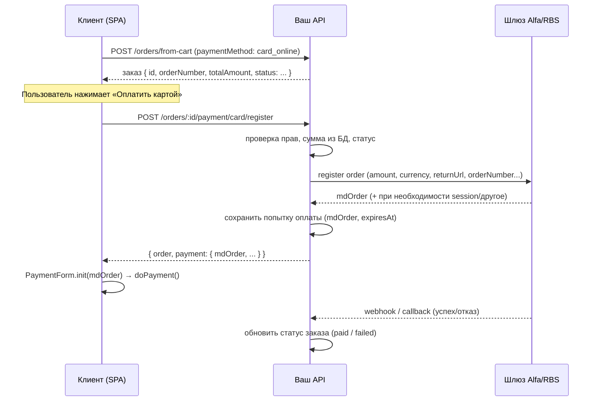

# Регистрация заказа в платёжном шлюзе (Alfa / RBS) — бэкенд

Инструкция для реализации **отдельного эндпоинта**, который по уже созданному заказу инициирует регистрацию платежа в шлюзе и возвращает **`mdOrder`** для Web SDK (multiframe) на фронте.

---

## 1. Зачем отдельный эндпоинт

- **Создание заказа** (`POST /orders/from-cart`) остаётся про бизнес-данные: корзина, адрес, способ оплаты, суммы. Ответ не обязан тащить секреты и данные шлюза.
- **Регистрация в шлюзе** требует **сервер-сервер** вызова с **логином/паролем или ключом мерчанта**. Это нельзя делать в браузере.
- **`mdOrder`** выдаётся шлюзом **после** регистрации конкретной попытки оплаты; его разумно отдавать **только когда пользователь реально переходит к оплате картой**, а не при каждом создании заказа.

Итог: **не расширяйте ответ `from-cart` условно** — добавьте **явный шаг** «подготовить оплату картой».

---

## 2. Рекомендуемый поток



---

## 3. Контракт API (пример)

Названия путей подставьте под свой роутер; смысл важнее формы.

### `POST /orders/:orderId/payment/card/register`

**Назначение:** зарегистрировать заказ в шлюзе и вернуть данные для Web SDK.

**Авторизация:** только владелец заказа (JWT `userId` === `order.userId`) или ваша политика.

**Тело (опционально):**

```json
{
  "returnUrl": "https://your-site.com/order/payment/return",
  "clientEmail": "user@example.com"
}
```

Поля зависят от требований шлюза и вашей 3DS/return flow — уточните по документации провайдера.

**Ответ 200 (пример):**

```json
{
  "order": {
    "_id": "...",
    "orderNumber": "...",
    "totalAmount": 129.99,
    "status": "pending_confirmation",
    "paymentMethod": "card_online"
  },
  "payment": {
    "mdOrder": "xxxxxxxx-xxxx-xxxx-xxxx-xxxxxxxxxxxx",
    "gateway": "rbs_alfabank",
    "amount": 129.99,
    "currency": "BYN",
    "expiresAt": "2026-04-18T12:30:00.000Z"
  }
}
```

- **`amount` / `currency`** в ответе должны **совпадать с тем, что ушло в шлюз** (см. ниже про валидацию).
- **`expiresAt`** — если шлюз или вы задаёте TTL сессии; иначе поле можно опустить.

**Ошибки:**

| Код | Когда |
|-----|--------|
| 400 | Заказ не в статусе, в котором разрешена оплата; неверный `paymentMethod` |
| 403 | Не владелец заказа |
| 404 | Заказ не найден |
| 409 | Уже оплачен / отменён / повторная регистрация при активной сессии (политика ниже) |
| 502 | Шлюз недоступен или вернул ошибку |

Текст ошибки для клиента — нейтральный («Не удалось инициализировать оплату»); детали — только в логах.

---

## 4. Что делать внутри хендлера (лучшие практики)

### 4.1. Всегда брать сумму из БД

Никогда не доверяйте сумме с клиента. Загрузите заказ по `orderId`, пересчитайте или возьмите сохранённый **`totalAmount`** (и валюту, если храните). Именно эти значения отправляйте в шлюз.

### 4.2. Проверки перед вызовом шлюза

- Заказ существует и принадлежит текущему пользователю.
- **`paymentMethod === 'card_online'`** (или эквивалент).
- Статус заказа допускает оплату (например `pending_confirmation`, а не `paid` / `cancelled`).
- Сумма > 0, валюта поддерживается.

### 4.3. Идемпотентность и повторные нажатия

- Реализуйте **идempotency-key** (заголовок `Idempotency-Key` или поле UUID от клиента) **или** храните последнюю успешную регистрацию на заказ.
- Если пользователь дважды нажал «Оплатить»:
  - либо вернуть **тот же `mdOrder`**, если сессия ещё жива (если шлюз это позволяет);
  - либо **отменить/закрыть** старую сессию в шлюзе (если API есть) и создать новую;
  - зафиксируйте политику в коде и в документации для поддержки.

### 4.4. Сохранение попытки оплаты

Введите сущность уровня **`payment_attempt`** (или поля в заказе, если проще на старте):

- `orderId`, `mdOrder`, `amount`, `currency`, `status` (`initiated` / `paid` / `failed` / `expired`),
- `createdAt`, при необходимости `expiresAt`,
- сырой ответ шлюза при ошибке — **без PAN/CVC** (их у вас не будет).

Это нужно для разбора инцидентов, сверки с эквайером и связи webhook → заказ.

### 4.5. Вызов шлюза

Конкретный URL и имя метода — **строго по документации** Alfa Bank / RBS для вашего окружения (тест `abby.rbsuat.com`, прод `ecom.alfabank.by` или актуальные хосты из договора).

Типичный набор параметров регистрации (имена могут отличаться):

- сумма и валюта;
- уникальный номер заказа в системе мерчанта (**ваш `orderNumber` или комбинация с префиксом**);
- URL возврата после оплаты / для callback;
- описание заказа (короткая строка);
- при необходимости — email/телефон для чека и 3DS.

**Секреты** (`userName`, `password`, `merchantLogin` и т.д.) — только из **переменных окружения** или секрет-хранилища, не в репозитории.

### 4.6. После успешного ответа шлюза

- Сохранить **`mdOrder`** и связь с заказом.
- Вернуть клиенту JSON с **`mdOrder`** и при необходимости дублировать **`order`** (срез полей без лишнего).

### 4.7. Webhook / обратные вызовы

Регистрация — только начало. Нужен **отдельный обработчик** callback от шлюза (URL задаётся при регистрации или в ЛК мерчанта):

- проверка подписи / IP whitelist — по доке провайдера;
- по **`mdOrder`** или **`orderId`** найти `payment_attempt` и заказ;
- идемпотентная обработка (один и тот же callback может прийти дважды);
- обновление **`order.status`** → `paid` или сценарий неуспеха;
- ответ шлюзу в требуемом формате (часто `OK`).

Без этого заказ останется «в ожидании» даже после успешной оплаты.

---

## 5. Почему не смешивать с `from-cart`

- Пользователь может создать заказ с `card_online`, но оплатить позже — тогда **`mdOrder`** на момент создания не нужен.
- Повторная инициализация оплаты (новый `mdOrder`) — отдельное событие; проще моделировать отдельным ресурсом **`.../payment/card/register`**.

При желании можно добавить **флаг** в `from-cart`: `initCardPayment: true` — и в одном ответе вернуть и заказ, и результат регистрации; это усложняет обработку ошибок шлюза при уже созданном заказе. Отдельный POST обычно **чище** и предсказуемее.

---

## 6. Связка с фронтом (pinkpunk_next_web)

После реализации эндпоинта на фронте:

1. После успешного `createOrderFromCart` (или по кнопке «Оплатить картой») вызвать **`POST .../payment/card/register`**.
2. Из ответа взять **`payment.mdOrder`** и передать в **`AlfaMultiframeCardForm mdOrder={...}`**.
3. Не хранить `mdOrder` в `localStorage` дольше сессии оформления — это привязка к платёжной сессии.

Переменная **`NEXT_PUBLIC_ALFA_MULTIFRAME_SCRIPT_URL`** и прокси **`apiContext`** (`/payment`) должны соответствовать тому же окружению (тест/бой), что и учётные данные на бэкенде.

---

## 7. Чеклист перед продакшеном

- [ ] Секреты шлюза не в коде и не в клиентском бандле.
- [ ] Сумма оплаты только с сервера из БД.
- [ ] Логи без PAN/CVC/полного номера карты.
- [ ] Webhook/callback обрабатывается и статус заказа обновляется.
- [ ] Тестовый и боевой терминалы разведены по env.
- [ ] Политика PCI DSS на стороне мерчанта согласована с юридическим/эквайером.

---

## 8. Документация провайдера

Точные поля запроса регистрации, формат `mdOrder`, требования к `returnUrl` и callback — только в **актуальной инструкции Alfa Bank / RBS** для вашего продукта (часто отдельные разделы для REST и для multiframe Web SDK).
