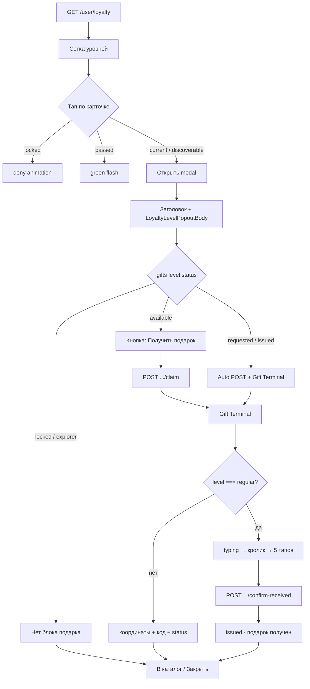

# TMA — карточки уровней лояльности (верстка как в web-профиле)

Спека для агента TMA: повторить **сетку и карточки уровней** из веб-профиля (`/user_profile`) один в один по визуалу и состояниям, плюс **полный флоу modal и подарка** (§10).

**С чего начать TMA:** §10 (user flow) → §5–6 (карточки) → §11 (terminal).

**Источник истины (web):**
- `src/components/ui/shared/LoyaltyStatusBlock.tsx` — `LoyaltyLevelsSection`, `LoyaltyLevelsGrid`, `LevelLadderCard`, **`LoyaltyGiftTerminal`**
- `src/utils/loyaltyLevelTheme.ts` — лестница, цвета, состояния
- `src/app/globals.css` — анимации карточек (строки ~345–457)
- `docs/TMA_DESIGN_TOKENS.md` — CSS-переменные уровней и бренда

**API:** `GET /user/loyalty` → тип `LoyaltyStatus` (`src/api/LoyaltyApi.ts`).

---

## 1. Где это в профиле (web)

Внутри левой колонки профиля, в glass-карточке:

```
┌─ bg-white/5, rounded-xl, border white/10, p-4 ─────────────┐
│  [Аватар + имя + скидка]                                     │
│  ───────── border-t white/10 ─────────                       │
│  «уровни» (заголовок секции)                                 │
│  ┌─────┐ ┌─────┐ ┌─────┐                                     │
│  │ Exp │ │ Reg │ │ Vibe│   ← сетка 3 колонки                 │
│  └─────┘ └─────┘ └─────┘                                     │
│       ┌─────┐ ┌─────┐                                        │
│       │ Ins │ │ Leg │   ← последний ряд центрирован (2 карты)│
│       └─────┘ └─────┘                                        │
│  ───────── border-t white/10 ─────────                       │
│  [Прогресс-бар + pts]                                        │
└──────────────────────────────────────────────────────────────┘
```

Компонент: `<LoyaltyLevelsSection embedded … />` в `src/app/user_profile/page.tsx`.

---

## 2. Секция «уровни»

### Обёртка (embedded в профиле)

| Свойство | Значение |
|----------|----------|
| Ширина | `100%` |
| Отступ сверху | `mt-4 pt-4` (или `pt-4` без `mt-4`, если над секцией уже есть подсказка) |
| Разделитель | `border-t border-white/10` |

### Заголовок

```html
<p class="text-[10px] uppercase tracking-wider text-white/35 text-center mb-4">
  уровни
</p>
```

---

## 3. Сетка карточек

```css
.grid {
  display: grid;
  width: 100%;
  grid-template-columns: repeat(3, 1fr);
  gap: 12px; /* sm: 16px */
}
```

**5 уровней → раскладка 3 + 2.** Второй ряд центрируется:

| index | level id | grid-column |
|-------|----------|-------------|
| 0 | explorer | auto |
| 1 | regular | auto |
| 2 | vibe_keeper | auto |
| 3 | insider | **col-start: 2** |
| 4 | legend | auto |

Логика: `levelCardColStartClass()` в `LoyaltyStatusBlock.tsx`.

---

## 4. Лестница уровней (данные)

Не хардкодить пороги exp в TMA — брать из API. Для **цветов и подписей** использовать ту же таблицу:

| id | label | min exp | max exp | CSS color | CSS glow |
|----|-------|---------|---------|-----------|----------|
| `explorer` | Explorer | 0 | 999 | `--level-bronze` `#cd7f32` | `--glow-bronze` |
| `regular` | Regular | 1 000 | 4 999 | `--level-silver` `#c0c0c0` | `--glow-silver` |
| `vibe_keeper` | Vibe Keeper | 5 000 | 9 999 | `--level-gold` `#ffd700` | `--glow-gold` |
| `insider` | Insider | 10 000 | 14 999 | `--level-sapphire` `#0f52ba` | `--glow-sapphire` |
| `legend` | Legend | 15 000 | ∞ | `--level-ruby` `#e0115f` | `--glow-ruby` |

Функции: `getLevelTheme(levelId)`, `resolveLadderState(itemId, currentLevelId)` → `locked | passed | current`.

---

## 5. Анатомия одной карточки (`LevelLadderCard`)

### Контейнер

| Свойство | Значение |
|----------|----------|
| Форма | `aspect-square` (квадрат 1:1) |
| Ширина | `width: 100%` ячейки сетки |
| Скругление | `rounded-xl` (12px) |
| Фон | `bg-white/[0.04]` |
| Бордер | `border border-white/10` |
| Padding | `p-2.5` (sm: `p-3`) |
| Layout | `flex flex-col text-center` |
| Курсор | `cursor-pointer` |

### Внутренняя структура (сверху вниз)

```
┌─────────────────────────┐
│ [🔓/🔒]          top-right│  ← иконка lock open/closed, absolute top-2 right-2
│                           │
│      [Level Icon 20px]    │  ← центр, цвет уровня
│      EXPLORER             │  ← label, font-durik, 10px, uppercase
│      0–1k                 │  ← exp диапазон, 8px, white/40
│                           │
│  ★ текущ. / ✨ открой …   │  ← статусная строка, 8px, снизу
└─────────────────────────┘
```

### Иконки — полная спека

На web используется **Heroicons v2, outline (24×24)** — пакет `@heroicons/react/24/outline`.

**В TMA:** подключить те же SVG (Heroicons) или 1:1 inline-SVG. Не заменять на другие пиктограммы — иначе визуал не совпадёт с профилем на сайте.

#### A. Центральная иконка уровня (всегда видна)

Расположение: по центру карточки, над названием уровня.

| `level.id` | Heroicon | Import | Смысл |
|------------|----------|--------|-------|
| `explorer` | **Map** | `MapIcon` | Старт пути / исследование |
| `regular` | **Check Circle** | `CheckCircleIcon` | Постоянный / подтверждённый |
| `vibe_keeper` | **Star** | `StarIcon` | Vibe / статус |
| `insider` | **Key** | `KeyIcon` | Доступ / инсайд |
| `legend` | **Trophy** | `TrophyIcon` | Максимальный уровень |

**Параметры (web):**

```tsx
import {
  MapIcon,
  CheckCircleIcon,
  StarIcon,
  KeyIcon,
  TrophyIcon,
} from '@heroicons/react/24/outline'

// LevelIcon — src/components/ui/shared/LoyaltyStatusBlock.tsx
<span className="inline-flex mx-auto" style={{ color: theme.labelColor }}>
  <MapIcon className="h-5 w-5" strokeWidth={1.5} />
</span>
```

| Свойство | Значение |
|----------|----------|
| Размер | `20×20px` (`h-5 w-5`) |
| Stroke | `1.5` |
| Цвет | `theme.labelColor` = `var(--level-*)` уровня |
| Fill | none (outline) |

**Fallback при неизвестном `level.id`:** `TrophyIcon` (как в web).

#### B. Иконка замка (правый верхний угол)

Показывается **только одна** — либо open, либо closed. Центральная иконка уровня при этом **не скрывается**.

```tsx
import { LockClosedIcon, LockOpenIcon } from '@heroicons/react/24/outline'
```

| Условие | Иконка | Размер | Цвет | strokeWidth |
|---------|--------|--------|------|-------------|
| `locked` и **не** discoverable | `LockClosedIcon` | `14×14px` (`h-3.5 w-3.5`) | `text-white/35` | `1.5` |
| `discoverable` | `LockOpenIcon` | `16×16px` (`h-4 w-4`) | `theme.labelColor` | `2` |

**Позиция:** `absolute top-2 right-2` (8px от краёв).

**Discoverable (LockOpen):** дополнительно glow на иконке:

```tsx
style={{
  color: theme.labelColor,
  filter: `drop-shadow(0 0 5px ${theme.labelColor})`,
}}
```

**Locked deny (тап по закрытой):** на `LockClosedIcon` класс `animate-loyalty-lock-shake`, цвет временно `text-white/55`.

#### C. Статусная строка снизу — **не иконки Heroicons**

Используются **Unicode-символы** в тексте (8px):

| Символ | Когда |
|--------|-------|
| `🔒` | locked |
| `✨` | discoverable («✨ открой») |
| `★` | current («★ текущ.») |
| `✓` | passed («✓ уровень пройден») |

В TMA можно оставить emoji как на web или заменить на SVG check/star — но тогда сохранить те же символы визуально.

#### D. Иконки **вне** карточки (контекст профиля — для справки)

Не часть сетки уровней, но рядом в том же блоке профиля:

| Место | Heroicon | Import |
|-------|----------|--------|
| Premium badge на аватаре | Check Badge (solid) | `@heroicons/react/24/solid` `CheckBadgeIcon` |
| Popout / gift terminal «скопировать» | Clipboard Document | `ClipboardDocumentIcon` |
| Popout / gift terminal «готово» | Check | `CheckIcon` |

Для **MVP TMA сетки уровней** достаточно блоков **A + B + C**.

#### E. Чеклист иконок

- [ ] 5 level icons: Map, CheckCircle, Star, Key, Trophy — outline, stroke 1.5, 20px
- [ ] LockClosed 14px, white/35 — только locked
- [ ] LockOpen 16px, цвет уровня + drop-shadow — только discoverable
- [ ] Цвет level icon = цвет уровня из `--level-*`
- [ ] Не использовать filled/solid для level icons (только outline)
- [ ] `aria-hidden="true"` на декоративных SVG; смысл — в `aria-label` кнопки карточки

#### F. Пример `LevelIcon` для TMA

```tsx
function LevelIcon({ id, color }: { id: string; color: string }) {
  const cn = 'h-5 w-5'
  const icons: Record<string, JSX.Element> = {
    explorer: <MapIcon className={cn} strokeWidth={1.5} />,
    regular: <CheckCircleIcon className={cn} strokeWidth={1.5} />,
    vibe_keeper: <StarIcon className={cn} strokeWidth={1.5} />,
    insider: <KeyIcon className={cn} strokeWidth={1.5} />,
    legend: <TrophyIcon className={cn} strokeWidth={1.5} />,
  }
  const normalized = id.trim().toLowerCase().replace(/\s+/g, '_')
  return (
    <span className="inline-flex mx-auto" style={{ color }} aria-hidden>
      {icons[normalized] ?? <TrophyIcon className={cn} strokeWidth={1.5} />}
    </span>
  )
}
```

Источник: `LevelIcon()` и `LevelLadderCard` в `LoyaltyStatusBlock.tsx`.

---

### Тексты

**Название уровня**
```css
font-family: Durik; /* font-durik */
font-size: 10px;
font-weight: 700;
text-transform: uppercase;
letter-spacing: 0.025em;
line-height: 1.25;
color: var(--level-*);
line-clamp: 2;
```

**Диапазон exp (компактный, на карточке)**
- Если `minPoints >= 1000`: `"1k–5k"`, `"5k–10k"`, `"10k–15k"`, `"15k+"`
- Иначе: `"0–999"` и т.п.
- Стиль: `8px`, `color: rgba(255,255,255,0.4)`

**Статусная подпись (нижняя строка, 8px, semibold)**

| state | discoverable | текст |
|-------|--------------|-------|
| locked | false | `🔒` |
| locked | true | `✨ открой` |
| passed | false | `✓ уровень пройден` |
| current | false | `★ текущ.` |
| current | true | `✨ открой` |

---

## 6. Состояния и стили

### `locked` (ещё не достигнут)

- Opacity: **0.4**
- Иконка: `LockClosedIcon`, `top-2 right-2`, `14px`, `white/35`
- Тап: короткая анимация «отказ» (`animate-loyalty-locked-deny-glow`), opacity → 0.55
- Бордер/glow: только на время deny-анимации, цвет уровня

### `passed` (уровень уже пройден, popout открыт)

- Opacity: **0.7**
- Тап: зелёный flash (`loyalty-passed-card--glow`, `#439f76`), подпись `✓ уровень пройден`
- Без glow рамки уровня

### `current` (текущий уровень)

- Opacity: **1**
- Рамка: `border-color: theme.labelColor`, `box-shadow: theme.glow`
- Ring: `ring-1 ring-inset`, `--tw-ring-color: theme.labelColor`
- Подпись: `★ текущ.`

### `discoverable` (можно открыть popout впервые)

- Opacity: **1**
- Иконка: `LockOpenIcon`, `16px`, цвет уровня + drop-shadow
- Анимация: **`animate-loyalty-card-shake`** (бесконечная лёгкая тряска)
- Рамка/glow как у current
- Подпись: `✨ открой`

### Highlight (Explorer при 0 exp)

- Дополнительно: `ring-2 ring-offset-1`, ring-color = цвет уровня
- Включается prop `highlightExplorerCard` когда `expPoints === 0`

### Active press (открываемые карточки)

- `active:scale-[0.98]` — только если не locked и не «passed closed»

---

## 7. CSS-анимации (скопировать в TMA)

Из `src/app/globals.css`:

1. **`@keyframes loyalty-card-shake`** + `.animate-loyalty-card-shake` — discoverable
2. **`@keyframes loyalty-locked-deny-glow`** + `.animate-loyalty-locked-deny-glow` — тап по locked
3. **`@keyframes loyalty-lock-shake`** + `.animate-loyalty-lock-shake` — иконка замка
4. **`@keyframes loyalty-passed-card-glow`** + `.loyalty-passed-card--glow`
5. **`@keyframes loyalty-passed-label-glow`** + `.loyalty-passed-label` / `--glow`

CSS-переменные на карточке при locked deny:
```css
--loyalty-card-glow: var(--glow-bronze); /* glow уровня */
--loyalty-card-color: var(--level-bronze);
```

---

## 8. Данные и логика (TMA)

### Запрос

```
GET /user/loyalty
Authorization: Bearer <accessToken>
```

### Минимальные поля для сетки

```typescript
type LoyaltyStatus = {
  expPoints: number
  level: { id: string; label: string; minPoints: number; maxPoints: number | null }
  nextLevel: { id: string; minPoints: number } | null
  pointsToNextLevel: number | null
}
```

### Вычисление state карточки

```typescript
function resolveLadderState(cardId: string, currentLevelId: string): 'locked' | 'passed' | 'current' {
  const ladder = ['explorer', 'regular', 'vibe_keeper', 'insider', 'legend']
  const currentIdx = ladder.indexOf(normalize(currentLevelId))
  const cardIdx = ladder.indexOf(normalize(cardId))
  if (cardIdx === currentIdx) return 'current'
  if (cardIdx < currentIdx) return 'passed'
  return 'locked'
}
```

### Discoverable (опционально, как на web)

Карточка «мигает» и открывается в popout, если пользователь ещё не смотрел её:

- Текущий уровень — пока не открыт popout
- Или следующий уровень — если `expPoints >= nextLevel.minPoints` или `pointsToNextLevel === 0`

Хранение «открытых» карточек: `localStorage` key `pp_loyalty_opened_cards` (см. `loyaltyLevelTheme.ts`).  
**Для MVP TMA** можно упростить: все `current` и достигнутые `next` кликабельны без localStorage.

### Клик по карточке

| state | действие |
|-------|----------|
| locked (не discoverable) | haptic + deny animation, без навигации |
| passed (popout уже был) | green flash, без навигации |
| current / discoverable | открыть экран/popup уровня |

---

## 9. Skeleton (loading)

Пока нет `LoyaltyStatus`:

```
заголовок «уровни»: pulse h-4 w-20 mx-auto mb-4
сетка 3 cols × 5 карточек: aspect-square rounded-xl bg-white/5 animate-pulse
```

---

## 10. Полный user flow: клик по карточке → modal → подарок

Это главная продуктовая спека для TMA. Web-реализация: `user_profile/page.tsx` + `LoyaltyLevelPopout` + `LoyaltyGiftTerminal`.

### 10.1. Данные до клика

**Запрос при загрузке профиля:**

```
GET /user/loyalty
Authorization: Bearer <accessToken>
```

**Ответ (`LoyaltyStatus`) — что нужно для сетки и modal:**

```typescript
{
  expPoints: number
  level: { id, label, minPoints, maxPoints }      // текущий уровень
  nextLevel: { id, label, minPoints, ... } | null
  pointsToNextLevel: number | null
  progressPercent: number | null
  discount?: {
    effectivePercent: number
    levelDiscountPercent: number
    // ...
  }
  gifts?: {
    regular?: LoyaltyGiftView
    vibe_keeper?: LoyaltyGiftView
    insider?: LoyaltyGiftView
    legend?: LoyaltyGiftView
  }
}
```

**`LoyaltyGiftView` (из `gifts`, без координат):**

```typescript
{
  levelId: 'regular' | 'vibe_keeper' | 'insider' | 'legend'
  levelLabel: string
  status: 'locked' | 'available' | 'requested' | 'issued'
  claimCode?: string
  requestedAt?: string
  confirmedAt?: string
  issuedAt?: string
}
```

| `gifts[level].status` | Значение для UI |
|----------------------|-----------------|
| `locked` | Уровень подарка ещё не достигнут — **блок подарка в modal не показываем** |
| `available` | Подарок можно запросить — кнопка **«Получить подарок»** |
| `requested` | Пользователь уже нажал claim — **сразу показываем gift terminal** (координаты) |
| `issued` | Подарок выдан — terminal в режиме **только просмотр** |

**Explorer** — офлайн-подарка нет (`gifts.explorer` не используется). В modal только текст + «В каталог» + «Закрыть».

---

### 10.2. Клик по карточке уровня

**Когда карточка кликабельна** (см. §6):

| state | клик |
|-------|------|
| `locked` (не discoverable) | deny-анимация, modal **не** открывается |
| `passed` (popout уже смотрели) | green flash, modal **не** открывается |
| `current` / `discoverable` | **открываем modal** |

**Обработчик (web):**

```typescript
handleLevelClick(levelId) {
  celebrate = (levelId === discoverableLevelId)  // confetti при первом открытии
  openModal(levelId)
}
```

**Discoverable** — карточка с ✨ «открой»: текущий уровень, который пользователь ещё не открывал, или следующий уровень при достаточном exp. Хранение: `localStorage` `pp_loyalty_opened_cards` (MVP TMA можно упростить).

---

### 10.3. Что показываем в modal (структура экрана)

TMA: полноэкранный sheet / modal (web — drawer справа).

```
┌──────────────────────────────────────┐
│ [confetti]                    [✕]    │  ← confetti если celebrate
├──────────────────────────────────────┤
│ Regular                              │  ← status.level.label, цвет уровня
│ 1 000 – 4 999 exp                    │  ← theme.expRangeLabel
│                                      │
│ {текст LoyaltyLevelPopoutBody}       │  ← §10.4
│                                      │
│ ┌─ gift terminal ИЛИ кнопка ─────┐  │  ← §10.5–10.7
│ └────────────────────────────────┘  │
│                                      │
│ [ Получить подарок ]  ← или скрыта   │
│ [ В каталог ]         ← не все уровни│
│ [ Закрыть ]                          │
│                                      │
│ Медианный уровень Vibe Keeper …     │  ← teaser, если есть nextLevel
└──────────────────────────────────────┘
```

**Откуда берём поля заголовка:**

| UI | Источник |
|----|----------|
| Название уровня в modal | `levelId` карточки → `getLadderItem(levelId).label` или label из API |
| Цвет заголовка / top border | `getLevelTheme(levelId).labelColor` |
| Диапазон exp под заголовком | `getLevelTheme(levelId).expRangeLabel` |
| Процент скидки в тексте | `status.discount.levelDiscountPercent` (fallback Explorer: 5%) |
| Ветка текста hasExp / no exp | `status.expPoints > 0` |

**При открытии modal (один раз):**

- `onOpened(levelId)` → сохранить в `pp_loyalty_opened_cards`, карточка перестаёт быть discoverable
- Если `celebrate` → confetti в цвете уровня

---

### 10.4. Текст в modal по уровням (`LoyaltyLevelPopoutBody`)

Переменные: `levelDiscount`, `hasExp = expPoints > 0`, `theme.labelColor`.

| level | rich popout | подарок | Текст |
|-------|-------------|---------|-------|
| **explorer** | да | нет | hasExp: поздравление + `{discount}%` скидки. !hasExp: призыв к первой покупке за 5% |
| **regular** | да | да + кролик | hasExp: поздравление + скидка + **«нажми получить подарок»**. !hasExp: описание порога 1000 exp |
| **vibe_keeper** | нет | да, без кролика | одна строка: `theme.perk` («Ранний доступ к дропам») |
| **insider** | да | да, без кролика | hasExp / !hasExp — как в коде (Insider / коллабы) |
| **legend** | нет | да, без кролика | одна строка: `theme.perk` («Максимальные привилегии») |

**Кнопка «В каталог»** — только если `richPopout` (explorer, regular, insider). Закрывает modal → переход в каталог.

Полные тексты — в `LoyaltyLevelPopoutBody`, `LoyaltyStatusBlock.tsx` (~914–1050).

---

### 10.5. Блок подарка: какая кнопка и когда

Условие показа блока подарка:

```typescript
giftLevelId = resolveGiftLevelId(levelId)  // null для explorer
levelGift = status.gifts?.[giftLevelId]
showGiftBlock = giftLevelId && levelGift && levelGift.status !== 'locked'
```

Если `showGiftBlock === false` — **ни кнопки, ни terminal нет** (только текст уровня).

**Матрица UI в modal:**

| `levelGift.status` | Что видит пользователь | API при открытии modal |
|--------------------|------------------------|-------------------------|
| `available` | Кнопка **«Получить подарок»** | ничего автоматически |
| `requested` | Сразу **gift terminal** (координаты) | auto `POST …/claim` (идемпотентно) |
| `issued` | Terminal **только просмотр** («подарок получен») | auto `POST …/confirm-received` (получить данные) |

```typescript
canClaimGift = levelGift.status === 'available' && !isAlreadyIssued(levelGift)
shouldBootstrapTerminal = levelGift.status === 'requested' || isAlreadyIssued(levelGift)
isAlreadyIssued = status === 'issued' || !!issuedAt
```

---

### 10.6. Шаг за шагом: пользователь нажал «Получить подарок»

```
[Кнопка «Получить подарок»]
        │
        ▼
POST /user/loyalty/gifts/:levelId/claim
Body: {}   ← пустое тело
        │
        ├─ 200 → LoyaltyGiftClaimResponse
        │         ├─ кнопка ИСЧЕЗАЕТ
        │         ├─ показывается Gift Terminal (§11)
        │         └─ GET /user/loyalty (refresh) → gifts.status станет requested
        │
        ├─ 400 «нужны имя/телефон» → показать ошибку + открыть форму профиля
        │
        └─ 400 «уже выдан» → fallback POST confirm-received (как issued)
```

**Ответ claim (`LoyaltyGiftClaimResponse`) — откуда terminal берёт данные:**

```typescript
{
  levelId, levelLabel,
  status: 'requested' | 'issued',
  claimCode: string,           // "PP-XXXX"
  recipientName: string,       // из профиля
  phone: string | null,
  username: string | null,
  expPoints: number,
  coordinates: { lat, lng },   // точка выдачи подарка
  addressLabel: string,        // человекочитаемый адрес
  confirmedAt?, issuedAt?
}
```

**После успешного claim:**

1. `showGiftTerminal = true`
2. `giftClaim = response`
3. `giftSkipIntro = false` (Regular — запускает typing + кролик)
4. Кнопка «Получить подарок» **больше не рenderится**

---

### 10.7. Когда кнопка меняется на «игру с кроликом» (только Regular)

| Уровень | После claim |
|---------|-------------|
| **regular** | Terminal → typing → status → **полоса с 🐇** (5 тапов) → кнопки «Поймал кролика» / «Назад» |
| vibe_keeper, insider, legend | Terminal → сразу **status** (координаты + код), **без кролика** |

**Regular — confirm после игры:**

```
[Поймал кролика]  (после 5 тапов по полосе)
        │
        ▼
POST /user/loyalty/gifts/regular/confirm-received
Body: {}
        │
        ▼
200 → claim.status = 'issued', issuedAt заполнен
      terminal → «подарок получен · дата»
      GET /user/loyalty (refresh)
```

**«Назад»** — сброс счётчика тапов, снова ловить кролика (без API).

**Non-Regular уровни:** confirm-received flow на web **пока не в UI** для vibe/insider/legend (terminal без интерактивного confirm-кролика). Выдача финализируется через CRM / офлайн. TMA — повторить web: terminal с координатами после claim, без кролика.

---

### 10.8. Повторное открытие modal (подарок уже requested / issued)

Пользователь закрыл modal и снова открыл карточку того же уровня:

| status | Поведение |
|--------|-----------|
| `requested` | При mount modal — auto `POST claim` → terminal с координатами, `skipIntro: true` (без typing) |
| `issued` | Auto `POST confirm-received` → terminal read-only, «подарок получен» |

Кнопки «Получить подарок» **нет** — сразу terminal.

---

### 10.9. Диаграмма полного флоу



---

### 10.10. API summary (все вызовы подарка)

| Действие | Method | URL | Body |
|----------|--------|-----|------|
| Загрузка loyalty | GET | `/user/loyalty` | — |
| Запросить подарок | POST | `/user/loyalty/gifts/:levelId/claim` | `{}` |
| Подтвердить получение (Regular) | POST | `/user/loyalty/gifts/:levelId/confirm-received` | `{}` |
| Refresh после claim/confirm | GET | `/user/loyalty` | — |

`:levelId` = `regular` | `vibe_keeper` | `insider` | `legend`.

**Ошибки claim (важно для TMA):**

- Сообщение про **имя / телефон / профиль** → попросить заполнить профиль, затем повторить claim
- **«уже выдан»** → вызвать `confirm-received` и показать terminal в режиме issued

---

### 10.11. Shell modal (визуал TMA)

- Фон: `#0a0a0b` ~97% opacity, blur
- Top border 3px цвета уровня + `boxShadow: theme.glow`
- Ширина web: ~21–24rem; TMA: full width sheet
- Кнопка закрыть ✕ + «Закрыть» внизу
- Morph из карточки **опционален**

Детали gift terminal (координаты, кролик, CSS) — **§11**.

---

## 11. Gift Terminal — координаты и кролик

Компонент web: **`LoyaltyGiftTerminal`** (`LoyaltyStatusBlock.tsx`, ~631–903).  
Показывается **внутри popout уровня**, под текстом, после успешного claim подарка.

**Источник CSS:** `src/app/globals.css` — `.loyalty-gift-terminal`, `.loyalty-terminal-rabbit-*` (~459–573).

### 11.1. Когда показывается

| Уровень | Подарок | Кролик |
|---------|---------|--------|
| `explorer` | нет | — |
| `regular` | да | **да** (полный flow) |
| `vibe_keeper`, `insider`, `legend` | да | **нет** (терминал без typing/кролика) |

Проверка: `loyaltyGiftLevelHasRabbitFlow(levelId)` → только `regular`.

Flow в popout:

1. Кнопка **«Получить подарок»** → `POST /user/loyalty/gifts/:levelId/claim`
2. Ответ `LoyaltyGiftClaimResponse` → показать `LoyaltyGiftTerminal`
3. После «Поймал кролика» (Regular) → `POST /user/loyalty/gifts/:levelId/confirm-received`

### 11.2. API

**Claim:**
```
POST /user/loyalty/gifts/:levelId/claim
Authorization: Bearer <token>
```

**Confirm (Regular — после кролика):**
```
POST /user/loyalty/gifts/:levelId/confirm-received
Authorization: Bearer <token>
```

**Тип ответа claim:**

```typescript
type LoyaltyGiftClaimResponse = {
  levelId: 'regular' | 'vibe_keeper' | 'insider' | 'legend'
  levelLabel: string
  status: 'requested' | 'issued'
  claimCode: string
  recipientName: string
  phone: string | null
  username: string | null
  expPoints: number
  coordinates: { lat: number; lng: number }
  addressLabel: string
  confirmedAt?: string
  issuedAt?: string
}
```

**Формат координат на экране:**
```typescript
formatGiftCoordinates({ lat, lng }) // → "53.894522, 27.541278"
```

### 11.3. Общий вид блока

Фиксированная высота **12.75rem (~204px)**, ширина 100% контейнера popout.

```
┌─────────────────────────────────────────────┐
│ 53.894522, 27.541278              [copy]    │  ← шапка
│ ул. Карла Либкнехта, 66 …                   │  ← addressLabel (если есть)
│ код: PP-A7K3                                │
│ ─────────────────────────────────────────── │
│                                             │
│ ты знаешь, что с этим делать , беги за      │  ← typing (только Regular)
│ белым кроликом и покажи это сообщение там   │
│                                             │
│        подарок ожидает получения            │  ← мигает
│ ┌─────────────────────────────────────────┐ │
│ │              🐇  →→→→→→→                 │ │  ← полоса кролика 40px
│ └─────────────────────────────────────────┘ │
└─────────────────────────────────────────────┘
```

### 11.4. Стили контейнера

| Свойство | Значение |
|----------|----------|
| Классы | `loyalty-gift-terminal loyalty-gift-terminal-shell` |
| Фон | `#050805` + `radial-gradient(ellipse, rgba(67,159,118,0.06), transparent 70%)` |
| Текст | `#439f76` (`--green` / catalog green), **`font-mono`** |
| Бордер | `border border-[#439f76]/40` |
| Inset shadow | `inset 0 0 0 1px rgba(67,159,118,0.35)` |
| Outer glow | `0 0 24px rgba(67,159,118,0.12)` |
| Скругление | `rounded-xl` |
| Padding внутренний | `p-2.5` |
| Min/height | `12.75rem` |

### 11.5. Шапка (координаты)

**Строка 1 — координаты + copy**

```html
<div class="flex items-start gap-1.5 border-b border-[#439f76]/20 pb-1.5 mb-1.5">
  <span class="text-[9px] tabular-nums leading-snug flex-1">{lat}, {lng}</span>
  <button><!-- ClipboardDocumentIcon 12px --></button>
</div>
```

- Copy: `navigator.clipboard.writeText(coordinates)`
- После копирования: иконка **Check** на 1.2s
- Heroicons: `ClipboardDocumentIcon`, `CheckIcon` — `@heroicons/react/24/outline`, `h-3 w-3`

**Строка 2** — `addressLabel`, `text-[9px]`, `text-[#439f76]/85` (если не пусто)

**Строка 3** — `код: **claimCode**`, `text-[9px]`, code semibold + tracking-wide

### 11.6. Фазы анимации (Regular + rabbit)

| phase | Что видно |
|-------|-----------|
| `opening` | пусто ~520ms |
| `blink` | мигающий block-курсор |
| `typing` | посимвольный набор текста |
| `typed` | полный текст, пауза 1s |
| `status` | строка статуса (мигает) |
| `rabbit` | полоса с 🐇 |

**Текст typing (Regular only):**
```
ты знаешь, что с этим делать , беги за белым кроликом и покажи это сообщение там
```

Константа: `GIFT_TERMINAL_MESSAGE` в `LoyaltyStatusBlock.tsx`.

**Статусная строка:** `подарок ожидает получения` — класс `loyalty-terminal-gift-status`, blink 1.1s.

**Без кролика** (остальные уровни): после opening сразу `status`, без typing и rabbit.

Тайминги:
- blink cursor: 480ms × 6 шагов
- typed → status: 1000ms
- status → rabbit: 1200ms

### 11.7. Полоса кролика (40px)

Класс слота: `loyalty-terminal-rabbit-slot`, высота `h-10` (40px).

**Idle / catch track:** `loyalty-terminal-rabbit-track`, фон `rgba(67,159,118,0.06)`.

**Кролик:** emoji `🐇` (`GIFT_TERMINAL_RABBIT`), класс `loyalty-terminal-rabbit`:
- бег слева направо: `loyalty-terminal-rabbit-marquee` 3.4s linear infinite
- лёгкий bounce: `loyalty-terminal-rabbit-run` 0.38s

**Интерактив (Regular, status ≠ issued):**

1. Полоса кликабельна — **5 тапов** (`GIFT_RABBIT_TAP_TARGET = 5`)
2. Класс: `loyalty-terminal-rabbit-track--catch`
3. После 5 тапов:
   - статус: `поймал кролика = подарок получен` (без blink)
   - две кнопки в ряд:
     - **«Поймал кролика»** — confirm (`border-[#439f76]/55`, `bg-[#439f76]/10`, `text-[9px]`)
     - **«Назад»** — сброс tap count, снова ловить

**После issued:**

```
подарок получен · 22.05.2026, 14:30
```

(`fmtGiftIssuedAt` — ru-RU datetime), без кролика и кнопок.

### 11.8. CSS для TMA (скопировать)

Из `globals.css`:

1. `@keyframes loyalty-terminal-cursor-blink` + `.loyalty-terminal-cursor`
2. `@keyframes loyalty-terminal-rabbit-run` + `.loyalty-terminal-rabbit`
3. `@keyframes loyalty-terminal-rabbit-marquee` + `.loyalty-terminal-rabbit-runner`
4. `.loyalty-terminal-rabbit-track`, `--catch`, `--idle`
5. `@keyframes loyalty-terminal-gift-blink` + `.loyalty-terminal-gift-status`, `--caught`
6. `.loyalty-gift-terminal`, `.loyalty-gift-terminal-shell`

### 11.9. Чеклист gift terminal

- [ ] Высота 12.75rem, mono, green `#439f76`, тёмный фон `#050805`
- [ ] Координаты `lat, lng` + copy + addressLabel + claimCode
- [ ] Regular: typing → status blink → rabbit marquee
- [ ] 5 тапов по полосе → confirm / назад
- [ ] Остальные уровни: без кролика, сразу status
- [ ] issued: «подарок получен · дата»
- [ ] API claim + confirm-received

---

## 12. Чеклист паритета для TMA

- [ ] Dark theme, токены из `TMA_DESIGN_TOKENS.md`
- [ ] Сетка 3 колонки, 5 карточек, второй ряд по центру
- [ ] Квадратные карточки, glass `white/4`, border `white/10`
- [ ] Цвет названия + glow рамки = цвет уровня
- [ ] 4 состояния: locked / passed / current / discoverable
- [ ] Иконки уровней и lock open/closed
- [ ] Компактный exp (`1k–5k` …)
- [ ] Статусные подписи снизу
- [ ] Анимации shake / deny / passed glow
- [ ] Заголовок секции «уровни» + border-top как в профиле
- [ ] **Полный флоу §10:** modal, тексты, кнопка подарка, claim/confirm API
- [ ] Gift terminal: координаты, код, кролик (Regular) — §11

---

## 13. Reference snippet (React / Tailwind)

Упрощённый каркас карточки для TMA:

```tsx
function LevelCard({ id, label, state, discoverable, onClick }: Props) {
  const theme = getLevelTheme(id)
  const locked = state === 'locked' && !discoverable
  const showGlow = state === 'current' || discoverable

  return (
    <button
      type="button"
      onClick={onClick}
      className={[
        'relative flex aspect-square w-full flex-col rounded-xl border border-white/10',
        'bg-white/[0.04] p-2.5 text-center',
        locked ? 'opacity-40' : state === 'passed' && !discoverable ? 'opacity-70' : 'opacity-100',
        discoverable ? 'animate-loyalty-card-shake' : '',
        showGlow ? 'ring-1 ring-inset' : '',
      ].join(' ')}
      style={showGlow ? { borderColor: theme.labelColor, boxShadow: theme.glow, ['--tw-ring-color' as string]: theme.labelColor } : undefined}
    >
      {/* LockOpen / LockClosed absolute top-2 right-2 */}
      <div className="flex flex-1 flex-col items-center justify-center gap-1.5">
        <LevelIcon id={id} className="h-5 w-5" color={theme.labelColor} />
        <p className="text-[10px] font-bold font-durik uppercase leading-tight line-clamp-2" style={{ color: theme.labelColor }}>
          {label}
        </p>
        <p className="text-[8px] text-white/40">{formatCompactExp(id)}</p>
      </div>
      <p className="mt-1 text-[8px] font-semibold text-white/45">{statusLabel(state, discoverable, locked)}</p>
    </button>
  )
}
```

Полная реализация с анимациями и popout: `LevelLadderCard` в `LoyaltyStatusBlock.tsx` (строки ~228–418).
