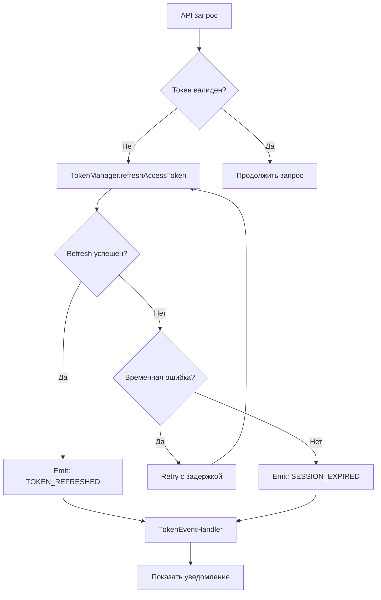

# 🔐 Управление токенами и сессиями v2.0

## 📋 Содержание

1. [Обзор изменений](#обзор-изменений)
2. [Параметры токенов](#параметры-токенов)
3. [Ключевые улучшения](#ключевые-улучшения)
4. [Архитектура](#архитектура)
5. [Использование](#использование)
6. [Обработка событий](#обработка-событий)
7. [Рекомендации](#рекомендации)

---

## 🎯 Обзор изменений

### Что было раньше (v1.0):

- ❌ Агрессивные `alert()` при ошибках авторизации
- ❌ Принудительный `window.location.reload()` при истечении токена
- ❌ Токены очищались при ЛЮБОЙ ошибке (даже сетевой)
- ❌ Нет retry-логики при временных сбоях
- ❌ Буфер обновления 5 минут
- ❌ Пользователя часто выкидывало из профиля

### Что стало (v2.0):

- ✅ Красивые неинвазивные уведомления
- ✅ Плавное предложение повторной авторизации (без reload)
- ✅ Умная обработка ошибок (временные vs критические)
- ✅ Автоматический retry с экспоненциальной задержкой (до 3 попыток)
- ✅ Увеличен буфер до 10 минут
- ✅ Фоновое обновление токенов
- ✅ Event-driven система уведомлений

---

## 📊 Параметры токенов

### От бэкенда:

```typescript
accessToken (JWT):
  - Формат: eyJhbGciOiJIUzI1NiIsInR5cCI6IkpXVCJ9...
  - Время жизни: 1 час (3600 секунд)
  - Использование: Authorization header для API запросов

refreshToken:
  - Формат: hex строка (64 символа)
  - Время жизни: 30 дней
  - Использование: обновление accessToken через /auth/refresh
```

### Временные параметры:

- **TOKEN_REFRESH_BUFFER**: 10 минут
  - Токен обновляется за 10 минут до истечения
  - При токене на 60 минут, обновление произойдет на 50-й минуте

- **MAX_RETRY_ATTEMPTS**: 3 попытки
  - При временных ошибках система делает до 3 попыток

- **RETRY_BASE_DELAY**: 1 секунда
  - Начальная задержка между попытками

- **RETRY_MAX_DELAY**: 10 секунд
  - Максимальная задержка (с экспоненциальным ростом)

---

## 🚀 Ключевые улучшения

### 1. Умная обработка ошибок

```typescript
// Критические ошибки (401) - очистка токенов:
- "Session expired"
- "No active sessions"
- "Telegram authentication expired"
- "Invalid refresh token"

// Временные ошибки - retry без очистки:
- Сетевые ошибки (нет интернета)
- Ошибки сервера (5xx)
- Таймауты
```

### 2. Retry-логика с экспоненциальной задержкой

```typescript
Попытка 1: сразу
Попытка 2: через 1 секунду
Попытка 3: через 2 секунды
Попытка 4: через 4 секунды (если макс. < 10 сек)
```

### 3. Фоновое обновление

```typescript
// Токен автоматически обновляется за 10 минут до истечения
// Пользователь не замечает обновления
tokenManager.saveTokens(data) → автоматически запускает таймер
```

### 4. Event-система

```typescript
export type TokenEventType = 
    | 'TOKEN_EXPIRED'           // Токен истек
    | 'TOKEN_REFRESHED'         // Успешное обновление
    | 'TOKEN_REFRESH_FAILED'    // Временная ошибка
    | 'SESSION_EXPIRED'         // Сессия истекла
    | 'TELEGRAM_AUTH_EXPIRED'   // Telegram auth устарел
    | 'NETWORK_ERROR';          // Нет интернета
```

---

## 🏗️ Архитектура

### Файлы:

```
src/
├── utils/
│   └── TokenManager.ts              # Ядро системы токенов
├── components/ui/shared/
│   └── TokenEventHandler.tsx        # UI обработчик событий
└── app/
    └── layout.tsx                   # Интеграция в приложение
```

### Поток данных:



---

## 💻 Использование

### 1. TokenManager (utils/TokenManager.ts)

#### Основные методы:

```typescript
// Получить access token (с автоматическим refresh)
const token = await tokenManager.getAccessToken()

// Получить token без refresh (синхронно)
const token = tokenManager.getAccessTokenSync()

// Сохранить токены после авторизации
tokenManager.saveTokens({
    accessToken: 'eyJ...',
    refreshToken: 'a1b2c3...',
    expiresIn: 3600
})

// Проверить авторизацию
const isAuth = tokenManager.isAuthenticated()

// Очистить токены
tokenManager.clearTokens()

// Подписаться на события
const unsubscribe = tokenManager.addEventListener((event, data) => {
    console.log('Token event:', event, data)
})
```

#### Новые методы:

```typescript
// Получить время до истечения токена (мс)
const timeLeft = tokenManager.getTimeUntilExpiry()

// Проверить, идет ли сейчас refresh
const isRefreshing = tokenManager.isCurrentlyRefreshing()
```

### 2. TokenEventHandler (компонент)

Автоматически интегрирован в `app/layout.tsx`:

```tsx
import TokenEventHandler from '@/components/ui/shared/TokenEventHandler'

export default function RootLayout({ children }) {
    return (
        <html>
            <body>
                <TokenEventHandler />  {/* ← Здесь */}
                <Header />
                {children}
                <Footer />
            </body>
        </html>
    )
}
```

**Что делает:**
- Подписывается на события токенов
- Показывает красивые уведомления
- Предлагает повторную авторизацию при критических ошибках
- Автоматически скрывает информационные уведомления через 10 секунд

### 3. Пример использования в компоненте

```tsx
'use client'

import { useEffect, useState } from 'react'
import { tokenManager } from '@/utils/TokenManager'

export default function MyComponent() {
    const [user, setUser] = useState(null)

    useEffect(() => {
        // Подписка на события токенов
        const unsubscribe = tokenManager.addEventListener((event) => {
            if (event === 'SESSION_EXPIRED') {
                // Сессия истекла, очищаем данные
                setUser(null)
            } else if (event === 'TOKEN_REFRESHED') {
                // Токен обновлен, можно продолжать
                console.log('Token refreshed in background')
            }
        })

        // Загрузка данных пользователя
        const loadUser = async () => {
            const token = await tokenManager.getAccessToken()
            if (token) {
                // Делаем API запрос
                const response = await fetch('/api/user', {
                    headers: {
                        'Authorization': `Bearer ${token}`
                    }
                })
                const userData = await response.json()
                setUser(userData)
            }
        }

        loadUser()

        return () => unsubscribe()
    }, [])

    return <div>{/* ... */}</div>
}
```

---

## 🎨 Обработка событий

### Типы уведомлений:

#### 1. INFO (синий) - Информационные

```typescript
'TOKEN_REFRESHED'
→ Заголовок: "Сессия обновлена"
→ Сообщение: "Ваша сессия была автоматически продлена"
→ Автоскрытие: через 10 секунд
```

#### 2. WARNING (желтый) - Предупреждения

```typescript
'TOKEN_REFRESH_FAILED'
→ Заголовок: "Проблема с подключением"
→ Сообщение: "Не удалось обновить сессию, повторяем попытку..."
→ Автоскрытие: через 10 секунд

'NETWORK_ERROR'
→ Заголовок: "Нет подключения"
→ Сообщение: "Проверьте интернет-соединение"
→ Автоскрытие: через 10 секунд
```

#### 3. ERROR (красный) - Критические

```typescript
'SESSION_EXPIRED'
→ Заголовок: "Сессия истекла"
→ Сообщение: "Ваша сессия истекла. Пожалуйста, авторизуйтесь заново..."
→ Кнопка: "Войти заново"
→ Автоскрытие: НЕТ (требует действия пользователя)

'TELEGRAM_AUTH_EXPIRED'
→ Заголовок: "Требуется повторная авторизация"
→ Сообщение: "Авторизация Telegram истекла (15 дней)..."
→ Кнопка: "Войти заново"
→ Автоскрытие: НЕТ

'TOKEN_EXPIRED'
→ Заголовок: "Сессия завершена"
→ Сообщение: "Пожалуйста, авторизуйтесь заново"
→ Кнопка: "Войти заново"
→ Автоскрытие: НЕТ
```

---

## 📝 Рекомендации

### ✅ DO (Делайте так):

1. **Используйте `getAccessToken()` для API запросов**
   ```typescript
   const token = await tokenManager.getAccessToken()
   // Токен будет автоматически обновлен, если нужно
   ```

2. **Подписывайтесь на события для реакции на изменения**
   ```typescript
   useEffect(() => {
       const unsubscribe = tokenManager.addEventListener((event) => {
           // Обработка события
       })
       return () => unsubscribe()
   }, [])
   ```

3. **Сохраняйте токены после авторизации**
   ```typescript
   tokenManager.saveTokens({
       accessToken,
       refreshToken,
       expiresIn
   })
   // Фоновое обновление запустится автоматически
   ```

4. **Используйте `TokenEventHandler` в layout**
   - Уже интегрирован в `app/layout.tsx`
   - Работает на всех страницах

### ❌ DON'T (Не делайте так):

1. **НЕ используйте `alert()` для ошибок авторизации**
   ```typescript
   // ❌ Плохо
   if (!token) {
       alert('Требуется авторизация')
   }

   // ✅ Хорошо
   if (!token) {
       // TokenEventHandler покажет уведомление
   }
   ```

2. **НЕ делайте `window.location.reload()` при ошибках**
   ```typescript
   // ❌ Плохо
   if (error.status === 401) {
       window.location.reload()
   }

   // ✅ Хорошо
   if (error.status === 401) {
       // TokenManager сам попробует обновить токен
       // TokenEventHandler покажет уведомление если не удастся
   }
   ```

3. **НЕ очищайте токены при временных ошибках**
   ```typescript
   // ❌ Плохо
   try {
       await api.call()
   } catch (error) {
       tokenManager.clearTokens() // Даже при сетевой ошибке!
   }

   // ✅ Хорошо
   try {
       await api.call()
   } catch (error) {
       // TokenManager сам решит, нужно ли очищать токены
   }
   ```

4. **НЕ делайте ручной refresh без необходимости**
   ```typescript
   // ❌ Плохо
   if (tokenManager.isAccessTokenExpired()) {
       await tokenManager.refreshAccessToken()
   }

   // ✅ Хорошо
   const token = await tokenManager.getAccessToken()
   // Refresh произойдет автоматически, если нужно
   ```

---

## 🔍 Отладка

### Логирование:

TokenManager активно логирует все действия:

```typescript
console.log('💾 Tokens saved successfully')
console.log('⏰ Background refresh scheduled in X minutes')
console.log('🔄 Refresh attempt 1/3')
console.log('✅ Tokens refreshed successfully')
console.log('🚨 Critical auth error, stopping retry')
console.log('❌ All refresh attempts failed')
console.log('🔔 Token Event: SESSION_EXPIRED')
console.log('🗑️ Tokens cleared')
```

### Проверка состояния:

```typescript
// В консоли браузера
tokenManager.isAuthenticated()
tokenManager.getTimeUntilExpiry() / 1000 / 60 // минут до истечения
tokenManager.isCurrentlyRefreshing()
```

---

## 🎯 Результаты

### Улучшения UX:

- ✅ **Нет внезапных перезагрузок** - плавное предложение повторной авторизации
- ✅ **Меньше разрывов сессии** - retry-логика справляется с временными сбоями
- ✅ **Фоновое обновление** - пользователь не замечает обновления токенов
- ✅ **Красивые уведомления** - вместо агрессивных alert()
- ✅ **Умная обработка ошибок** - различает критические и временные проблемы

### Технические преимущества:

- ✅ **Event-driven** - легко интегрировать в любой компонент
- ✅ **Decoupled** - UI отделен от бизнес-логики
- ✅ **Resilient** - устойчивость к сетевым сбоям
- ✅ **Observable** - детальное логирование для отладки
- ✅ **Maintainable** - чистый и понятный код

---

## 📞 Контакты

При возникновении вопросов или проблем:
- Проверьте логи в консоли браузера
- Убедитесь, что `TokenEventHandler` добавлен в `layout.tsx`
- Проверьте события в DevTools → Application → Local Storage

---

**Версия документации:** 2.0  
**Дата обновления:** 2025-11-20  
**Автор:** Pink Punk Development Team

